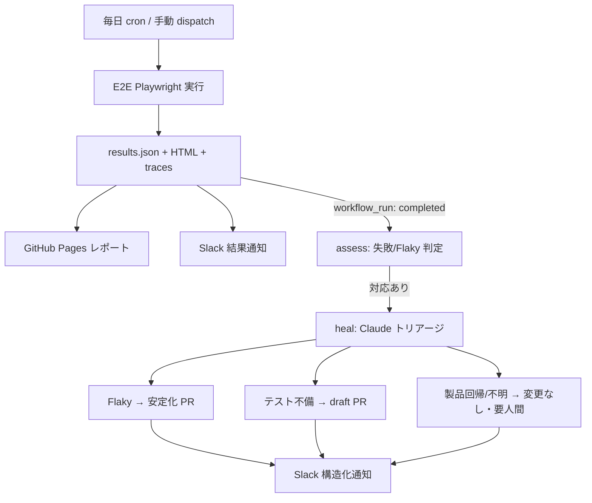

# Swag Labs E2E Test Project

このリポジトリは、[Swag Labs](https://www.saucedemo.com/) を対象とした E2E テスト自動化プロジェクトです。

## 1. フォルダ構成

プロジェクトは以下の構成で整理されています。

```text
.
├── .cursor/rules/              # Cursor AI 用のコーディングルール定義
├── .github/
│   ├── workflows/
│   │   ├── playwright.yml          # PR/Push 時の高速 CI
│   │   ├── e2e-playwright.yml      # 定期 E2E 実行 + レポート公開 + Slack 通知
│   │   └── e2e-auto-heal.yml       # Claude による自動修復（workflow_run 起動）
│   └── auto-heal-prompt.md     # 自動修復ポリシー（Claude への指示）
├── docs/
│   └── auto-heal.md            # 自動テスト基盤のセットアップ・安全モデル
├── e2e/
│   ├── constants/              # 共通定数 (メッセージなど)
│   ├── helpers/                # 共通ユーティリティ (環境変数など)
│   ├── pages/                  # Page Object Model (画面操作ロジック)
│   └── tests/                  # テストシナリオ (.spec.ts)
├── playwright.config.ts        # Playwright 設定ファイル
└── package.json                # 依存関係管理
```

## 2. 実装ルール（設計指針）

本プロジェクトでは、AI アシスタントが遵守すべきコーディングルールを定義しています。詳細は以下のファイルを参照してください。
- [`.cursor/rules/cording-rule.mdc`](.cursor/rules/cording-rule.mdc)

### 主な指針
- **Page Object Model の徹底**: すべての Page Object は `BasePage` を継承し、要素定義にはアロー関数を使用することで最新の DOM 状態を保証します。
- **検証の分離**: Page Object 内に `expect` は記述せず、テストファイル側でアサーションを行います。
- **環境管理**: `process.env` を直接参照せず、`Env.ts` ヘルパーを経由します。
- **セレクター選定**: `data-testid` に頼らず、`getByRole` や `getByLabel` などのアクセシビリティ属性を優先的に使用します。

## 3. 手動テストケース

### テストケース 1: ログイン
- **前提条件**: ブラウザで `https://www.saucedemo.com/` にアクセスしていること。
- **手順**:
  1. ユーザー名に `standard_user` を入力する。
  2. パスワードに `secret_sauce` を入力する。
  3. 「Login」ボタンをクリックする。
- **期待結果**: 商品一覧ページ（Inventory Page）が表示されること。

### テストケース 2: 商品の購入フロー
- **前提条件**: `standard_user` でログイン済みであること。
- **手順**:
  1. 「Sauce Labs Backpack」の「Add to cart」ボタンをクリックする。
  2. 右上のカートアイコンをクリックする。
  3. カートページで「Checkout」ボタンをクリックする。
  4. 配送先情報（姓名、郵便番号）を入力し、「Continue」をクリックする。
  5. 確認ページで「Finish」をクリックする。
- **期待結果**: 「Thank you for your order!」というメッセージが表示されること。

### テストケース 3: ログアウト
- **前提条件**: ログイン済みであること。
- **手順**:
  1. 左上のハンバーガーメニューをクリックする。
  2. メニュー内の「Logout」をクリックする。
- **期待結果**: ログインページに遷移すること。

### テストケース 4: 商品の並び替え
- **前提条件**: ログイン済みであること。
- **手順**:
  1. 商品一覧ページのソートプルダウンから「Name (A to Z)」、「Name (Z to A)」、「Price (low to high)」、「Price (high to low)」を順に選択する。
- **期待結果**: それぞれの選択に合わせて、商品名または価格が昇順・降順に正しく並び替えられること。

## 4. 技術スタック
- **言語**: TypeScript
- **テストフレームワーク**: Playwright
- **デザインパターン**: Page Object Model (POM)
- **CI/CD**: GitHub Actions

## 5. セットアップと実行方法

### ローカル実行
```bash
# 依存関係のインストール
npm install

# ブラウザのインストール
npx playwright install chromium

# テストの実行
npx playwright test
```

## 6. 自動テスト基盤（Automated Testing Platform）

夜間の E2E 実行を「自己保守ループ」に変える基盤を実装しています。スケジュール実行 → レポート公開 → Slack 通知 → **Claude による自動修復** までを GitHub Actions で完結させます。詳細なセットアップと安全モデルは [`docs/auto-heal.md`](docs/auto-heal.md) を参照してください。



### ワークフロー一覧

| ワークフロー | トリガー | 役割 |
|---|---|---|
| `playwright.yml` | PR / Push | 高速フィードバック用 CI。レポートを Artifact 保存。 |
| `e2e-playwright.yml` | 毎日 02:00 JST / 手動 | 回帰スイートを実行し、`results.json`・HTML レポート・トレースを出力。GitHub Pages へ公開し Slack 通知。 |
| `e2e-auto-heal.yml` | `e2e-playwright.yml` 完了時 | 失敗/Flaky を判定し、Claude が 3 区分（Flaky / テスト不備 / 製品回帰）に分類して対応。 |

### 判定区分（Triage Buckets）

| 区分 | 判定根拠 | 対応 |
|---|---|---|
| Flaky | リトライで合格 | テスト安定化 → 再検証 → 通常 PR |
| テスト不備 | 仕様どおりだがテストが古い | テスト修正 → draft PR（人間レビュー） |
| 製品回帰 / 不明 | アプリ誤動作 or 原因不明 | コード変更なし → Slack で要人間 |

### 手動実行方法
GitHub リポジトリの **Actions** タブから `E2E Playwright` ワークフローを選択し、**Run workflow** をクリックすると任意のタイミングで実行できます（`base_url` を指定すると対象環境を切り替え可能）。

### 必要な設定
- **GitHub Pages**: Settings → Pages → Source を「GitHub Actions」に設定。
- **Secrets**: `ANTHROPIC_API_KEY`（自動修復用・必須）、`SLACK_WEBHOOK_URL`（通知用・任意）。

> このサンプルでは、QA 方針書（`policy/自動テスト基盤.md`）の Cloudflare Pages を、外部アカウント不要で動かせる **GitHub Pages** に置き換えています。
