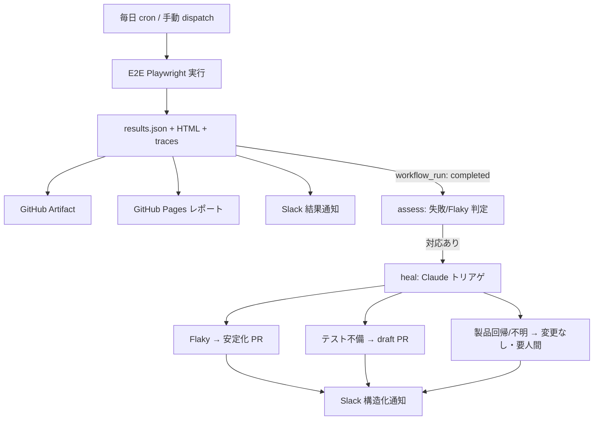

# 自動テスト基盤 — セットアップと安全性（Setup & Safety）

本書は、本リポジトリに実装した **E2E 自動テスト基盤**（定期実行 → レポート公開 → Slack 通知 → Claude 自動修復）のセットアップ手順と安全モデルをまとめたものです。基盤の全体像は QA リポジトリの `policy/自動テスト基盤.md` を参照してください。

> 注: 基盤の方針書ではレポートホスティングに Cloudflare Pages を採用していますが、本サンプルでは外部アカウント不要で動かせる **GitHub Pages** に置き換えています。

---

## 1. 構成要素（Components）

| 要素 | ファイル | 役割 |
|---|---|---|
| Playwright E2E スイート | `e2e/` | 回帰必須・正常系の spec（TypeScript / Page Object Model）。 |
| E2E ワークフロー | `.github/workflows/e2e-playwright.yml` | 毎日のスケジュール＋手動実行。`results.json`・HTML レポート・トレースを出力し、GitHub Pages へ公開、Slack 通知。 |
| 自動修復ワークフロー | `.github/workflows/e2e-auto-heal.yml` | `workflow_run` で起動。`assess` ジョブで対応要否を判定、`heal` ジョブで Claude を実行。 |
| 自動修復ポリシー | `.github/auto-heal-prompt.md` | Claude に渡す指示（3 区分のトリアゲ・安全モデル・Slack 通知の中身）。 |
| PR/Push CI | `.github/workflows/playwright.yml` | 既存の PR/Push 時の高速フィードバック用（自動修復は走らせない）。 |

---

## 2. 必要な設定（Prerequisites）

### 2.1 GitHub Pages を有効化

リポジトリの **Settings → Pages → Build and deployment → Source** を **「GitHub Actions」** に設定する。これで `e2e-playwright.yml` の `report` ジョブが HTML レポートを公開できる。

### 2.2 GitHub Secrets を登録

**Settings → Secrets and variables → Actions** に以下を登録する。

| Secret 名 | 用途 | 必須 |
|---|---|---|
| `ANTHROPIC_API_KEY` | Claude 自動修復（`anthropics/claude-code-action`）の認証。 | 自動修復を使う場合は必須 |
| `SLACK_WEBHOOK_URL` | Slack Incoming Webhook の URL。結果通知・自動トリアゲ通知に使用。 | 任意（未設定なら通知をスキップ） |

> `GITHUB_TOKEN` は GitHub Actions が自動提供するため登録不要。`AUTO_HEAL_PROMPT` は workflow 内で `.github/auto-heal-prompt.md` から動的に生成する環境変数で、登録は不要（エディタの静的 Lint で未定義警告が出ることがあるが想定どおり）。

### 2.3（任意）Slack Incoming Webhook の作成

Slack で App を作成し、Incoming Webhooks を有効化 → 投稿先チャンネルの Webhook URL を取得して `SLACK_WEBHOOK_URL` に登録する。

---

## 3. エンドツーエンドの流れ（End-to-End Flow）

1. **トリガー**: 毎日 02:00 JST の cron、または `workflow_dispatch`（手動実行。`base_url` を指定すると対象環境を切り替え可能）。
2. **E2E 実行**: `e2e-playwright.yml` が Playwright を実行。`results.json`・HTML レポート・トレースを生成し、アーティファクト化＋ GitHub Pages 公開＋ Slack 通知。
3. **assess**: 完了時に `e2e-auto-heal.yml` が `workflow_run` で起動。`results.json` の `stats.unexpected` / `stats.flaky` を見て、失敗または Flaky があるときだけ後続を実行。
4. **heal**: 最新の `main` をチェックアウトしてテスト環境を再構築し、失敗実行の結果とトレースを取得して Claude を実行。
5. **対応**: Claude が各 spec を 3 区分に分類して対応し、構造化された Slack 通知を投稿。



---

## 4. 判定区分（Triage Buckets）

| 区分 | 判定根拠 | 対応 |
|---|---|---|
| **Flaky / フレキー** | リトライで合格した spec。 | テスト側のみ安定化し、反復実行で再検証して **通常 PR**（ゲート付き自動マージ想定）。 |
| **テスト不備 / Test-side defect** | 恒常的に失敗するが、仕様どおりアプリは正常でテストが古い。 | 修正・再検証して **draft PR**。人間がレビュー。自動マージしない。 |
| **製品回帰 / Product regression** | 恒常的に失敗しアプリが誤動作、または原因不明。 | **コード変更なし**。Slack で人間判断にエスカレーション。 |

---

## 5. 安全モデル（Safety Model）

- **製品コードには触れない。** 変更はテスト層（`e2e/` と設定）に限定する。
- **アサーション/期待値を「合格のためだけ」に書き換えない。** Flaky 安定化経路では変更しない。テスト不備経路で直す場合も仕様一致が目的で、draft PR にとどめる。
- **製品回帰の疑いは自動修正しない。** 本物のバグを覆い隠さないため、触れずにエスカレーションする。
- **迷ったら安全側へ。** 区分が曖昧なら「製品回帰 / 要人間」に倒す。
- **秘匿情報をコミット/投稿しない。**
- すべての対応は **PR と Slack 通知**として可視化され、ループは監査可能。

### 自動マージのゲート（任意・推奨）

Flaky 区分の PR を実際に自動マージする場合は、**ブランチ保護ルール**（必須ステータスチェック = `playwright.yml` / `E2E Playwright` の通過）と GitHub の **Auto-merge** を有効にし、再検証通過後にのみマージされるようにする。本サンプルでは PR 作成までを既定とし、マージは人間またはゲートに委ねる。

---

## 6. ローカルでの実行（Run locally）

```bash
npm ci
npx playwright install --with-deps chromium
npm test            # = playwright test
npm run report      # HTML レポートを開く
```

別環境を対象にする場合は `BASE_URL=https://example.com npm test`。
